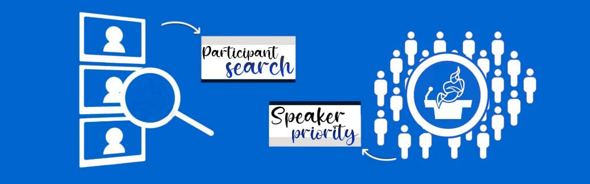

## This repo created  for a theme of  [Jitsi Hackathon](https://platform-euhack21.bemyapp.com/#/event)
> You can follow the developments to be made on the jitsi-meet project from this repo. And you can give suggestions for development. 

### Projects
- ___[Active Speaker](https://github.com/bayraktarulku/jitsi-projects/tree/main/activeSpeaker)___
 
  
  
  Project's hackaton link: https://platform-euhack21.bemyapp.com/#/projects/6082d2112f90ac001965e417
 
 
- ___[Emoji Reaction](https://github.com/bayraktarulku/jitsi-projects/tree/main/emoji-reaction)___
 
  
  
  Project's hackaton link: https://platform-euhack21.bemyapp.com/#/projects/608acbb203a87f0019ef3f6a
  
  
## Contributors
- [Seda Çağlar](https://github.com/sdcaglar)
- [Kübra Yavuz](https://github.com/kubrayavuz)
- [Gülistan Dalbudak](https://github.com/guli-dlbdk)
